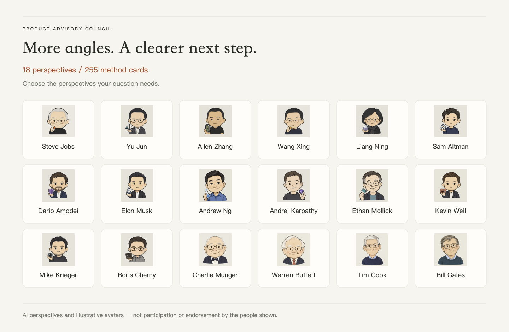
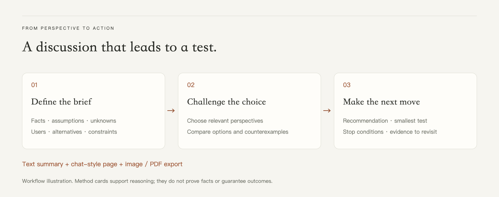
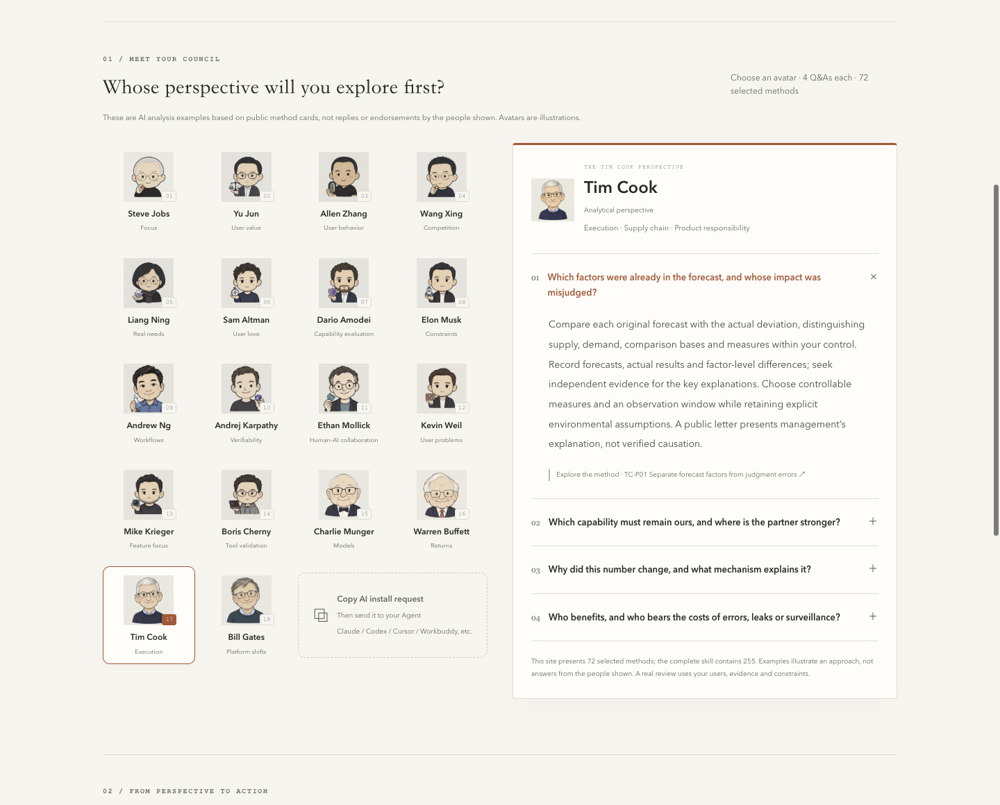
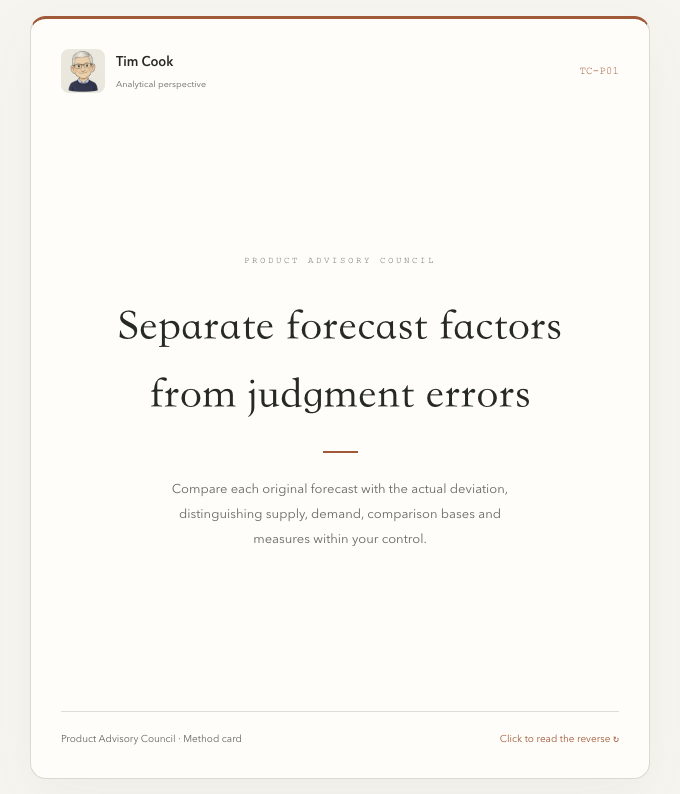
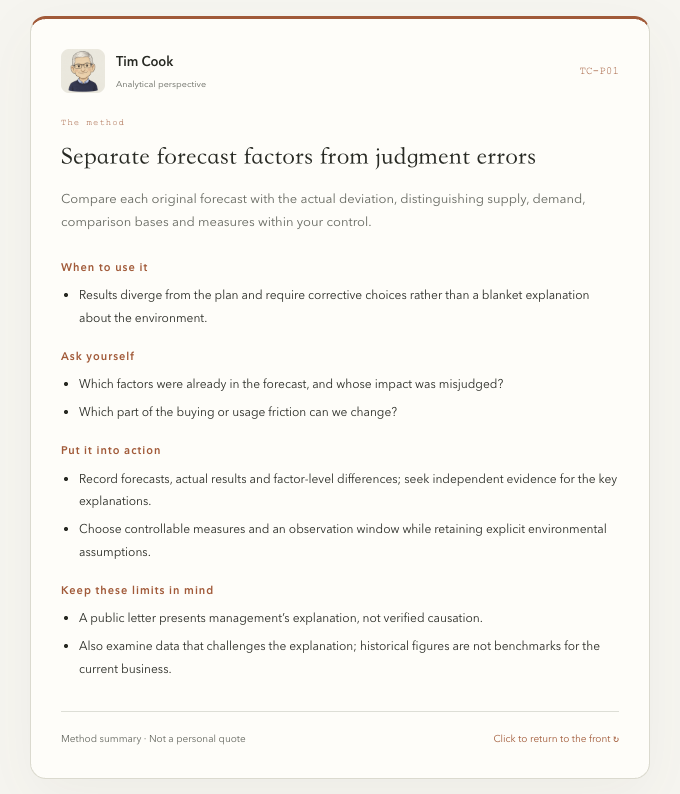

[简体中文](README.md) · [English](README.en.md)

<p align="center"></p>

# Product Advisory Council

**One product question. Eighteen ways to think it through.**

An AI skill for exploring product decisions through selected product and AI perspectives. Challenge assumptions, preserve meaningful disagreement, and turn advice into a testable next step.

**One skill folder · 18 advisor modules · 255 decision method cards.** Use one perspective or convene a council, generate a chat-style discussion page, and export the conversation as images or PDF.

These advisors are AI analytical perspectives based on curated methods, not the actual people. They do not imply endorsement, equivalent access to a human advisor, or guaranteed business results.

[Explore the interactive showcase](https://luffyliu.com/en/product-advisory-council/) · [Download v2.3.1](https://github.com/CarGod/product-advisory-council/releases/tag/v2.3.1) · [Skill entry point](product-advisory-council/SKILL.md)

## See how the perspectives work





The images above summarize the skill and its workflow. The live website screenshots below show the updated 18-perspective showcase.

Choose an avatar to explore **four example questions and answers per advisor — 72 in total, linked to 72 selected method pages**. Follow a method link to a flip card: the front names the method; the back explains when to use it, what to ask, what to do, and where it stops applying.

[](https://luffyliu.com/en/product-advisory-council/#meet)

| Front: remember the method | Back: put it to work |
| --- | --- |
| [](https://luffyliu.com/en/product-advisory-council/cards/tc-p01/) | [](https://luffyliu.com/en/product-advisory-council/cards/tc-p01/) |

The website supports Simplified Chinese, Traditional Chinese, English, Japanese, Korean and Spanish, including Q&As, method cards and Agent installation prompts. The screenshots above show the English UI. The website presents 72 selected methods; the complete skill includes 255 cards. The showcase uses prewritten AI analysis examples, not live chat or statements by the people represented. This repository provides Chinese and English introductions; the skill's method materials are primarily Chinese.

## Ask your Agent to install it

Copy this request to **Claude, Codex, Cursor, Workbuddy, or another Agent**. Installation depends on the client's skill support and the tools available in your environment.

```text
Please install the Product Advisory Council skill so I can use its expert analytical perspectives in this Agent.

Public repository: https://github.com/CarGod/product-advisory-council

First read the repository README and installation instructions. Identify your current client and its supported skill installation method, then install the complete product-advisory-council folder. Do not copy only SKILL.md. If an older version exists, back it up before updating.

After installation, check that the skill files are complete and that the client can discover the skill. Tell me how to start using it and whether I need a new session. If you cannot install it directly, explain why and provide the fewest manual steps appropriate for this client. Do not claim installation succeeded without verifying it.
```

## What can you discuss?

- Whether a product direction is worth pursuing, and whom to serve first.
- Feature priorities, pricing, growth, and business model tradeoffs.
- Whether an opportunity remains after discovering competitors.
- How to narrow an experiment, test assumptions, and define stopping conditions.

Discussions begin with one shared brief and distinguish facts, assumptions, and unknowns. The result includes a recommendation, alternatives, disagreements, the strongest counterargument, and a next experiment. Decisions are not made by counting famous names or forcing consensus.

By default, even a short or single-perspective review delivers a written summary and a chat HTML page. Exceptions apply when you explicitly decline the page or the environment cannot generate it.

## The 18 perspectives

These are the tool's curated focus areas, not complete descriptions of each person's views.

| Perspective | Focus |
| --- | --- |
| Steve Jobs | Focus, experience, product communication, delivery tradeoffs |
| Yu Jun | Relative user value, alternatives, exchange, utility |
| Allen Zhang | User behavior, restraint, system rules, failure paths |
| Wang Xing | Competition, organization, long-term investment, business boundaries |
| Liang Ning | Real needs, perceived value, shared understanding, business models |
| Sam Altman | User love, unit economics, direction, iteration |
| Dario Amodei | Capability evaluation, independent signals, risk controls |
| Elon Musk | Constraint analysis, negative feedback, engineering validation |
| Andrew Ng | Workflows, evaluation, error analysis, small experiments |
| Andrej Karpathy | Verifiability, trusted baselines, real delivery |
| Ethan Mollick | Human–AI collaboration, organizational learning, real-task evaluation |
| Kevin Weil | User problems, prototypes, AI product workflows |
| Mike Krieger | Feature focus, feedback, teams, agent products |
| Boris Cherny | Tool validation, iteration, collaborative feedback |
| Charlie Munger | Incentives, inversion, interacting errors, limits of competence |
| Warren Buffett | Resource allocation, business quality, long-term costs and risk |
| Tim Cook | Execution, supply chains, responsibility, value tradeoffs |
| Bill Gates | Learning feedback, software delivery, platform dependencies, sustainable supply |

## Manual installation

1. Download `product-advisors-public-v2.3.1.zip` from [Releases](https://github.com/CarGod/product-advisory-council/releases).
2. Extract and keep the **entire `product-advisory-council/` folder**. Do not copy only `SKILL.md`; the advisors do not need separate installation.
3. Import the folder through your AI client's supported skill mechanism, or place it in the client's skill directory. Follow that client's documentation.

For a local Codex installation, use `~/.codex/skills/product-advisory-council/`, or `skills/` under a custom `CODEX_HOME`. Start a new session and check discovery. Back up an existing installation before replacing the full folder to avoid stale files.

If you previously installed the five separate `product-advisor-*` skills, back them up and remove the old copies after confirming the new skill works.

The package includes instructions and local helper scripts, **not a model or API key**. Text reviews require a skill-capable AI client. Search and chat scripts use the **Python 3.9+ standard library**. Chat pages and image exports require a modern browser with JavaScript, Canvas, and download support; the host Agent also needs file, script, and local-page capabilities. Use text-only reviews when these capabilities are unavailable.

## Example requests

**One perspective**

> Use the Yu Jun perspective from Product Advisory Council: our free tool is considering a paid subscription. How should we test willingness to pay?

**Standard review**

> Use Product Advisory Council at medium depth. I want to build an AI note-taking tool, but there are many competitors. Identify the key differentiation hypothesis and design an experiment I can run in two weeks.

**A full discussion**

> Run a high-depth council discussion: should our small team prioritize growth or retention? Keep disagreements visible, provide a conditional decision and validation plan, and generate a chat-style HTML page.

**Follow up or wrap up**

> Ask Allen Zhang to respond to Yu Jun's counterexample.
>
> Wrap up: separate confirmed facts, untested assumptions, and the next actions.

**Share the discussion**

> Export this discussion as images, preserving the chat layout and using smart 9:16 pagination.

Provide the target user, current alternatives, actual data, resources, and deadline. Leave unknowns explicitly unknown instead of inventing numbers.

## Choose participation and depth

All 18 advisors do not need to participate. Specify required participants, exclusions, or an exclusive list. The host selects perspectives relevant to the question and records why participants join. Explicit exclusions are respected.

| Depth | Main emphasis | Planned cross-discussion rounds / maximum |
| --- | --- | --- |
| Fast | Recommendation, reason, biggest unknown, next step | 0 / 1 if necessary |
| Low | Alternatives, substantive objections, validation action | 1 / 2 |
| Medium | Assumptions, counterarguments, revisions, minimum experiment | 2 / 3 |
| High | Fact review, competing explanations, stress tests, opportunity cost | 3 / 5 |
| Very high | Sensitivity, failure paths, evidence gaps, final counter-review | 4 / 7 |

Rounds are a budget, not a quota. Discussions may finish early. You can intervene, change depth, or ask to wrap up. If no depth is specified, the skill asks; an explicit request to proceed directly defaults to medium with disclosure.

Depth does not change the model or its internal reasoning settings. If a single model simulates multiple perspectives sequentially, this must be disclosed; it is not independent model cross-validation. See the [depth protocol](product-advisory-council/references/discussion-depth.md).

## Chat pages and exports

Generated pages include avatars, message bubbles, method cards, and decision cards. Method links open details. Tables remain tables on desktop and become attribute cards on mobile and image export.

Exports include a long image, one complete bubble per image, whole-bubble compositions, smart pagination, and PDF. Smart pagination supports **9:16, 9:19.5, 3:4, 4:5, and 1:1**. PDF exports preserve the visual chat layout as images, not searchable text. Very long discussions should use split images.

The chat interface does not call a model itself: the host Agent writes responses. Saving a message does not automatically wake the Agent; return to your main conversation when necessary. The local service listens only on the local machine, and generated pages do not load external resources. Exports are produced locally and are not automatically posted anywhere. The host AI service's own data handling still depends on its configuration and policies.

Check business and personal information before sharing; image exports do not automatically redact it. See the [chat and export guide](product-advisory-council/references/group-chat.md).

## Evidence and limitations

Public cards contain method summaries, conditions, boundaries, questions, and suggested actions. **Card IDs locate methods; they are not original-source citations or proof of a business claim.**

Original books, recordings, transcripts, web pages, reading notes, and source mappings are not distributed. The skill does not automatically search private material. Source verification requires separately provided or explicitly authorized material, with the verification scope disclosed.

This is a decision-method tool, not trained model weights. Functional checks cover retrieval, participant filtering, chat records and rendering, discussion depth, export pagination, and private-card isolation. They do not establish decision accuracy or business outcomes. See [evaluation status](product-advisory-council/references/evaluation-status.md).

## Package structure

```text
product-advisory-council/
├── SKILL.md       # Entry point and routing
├── advisors/     # 18 perspective modules
├── references/   # Method cards, protocols, brief and report templates
├── scripts/      # Search and local chat runtime
├── assets/       # Illustrated avatars, chat UI and export support
├── agents/       # Client display metadata
└── manifest.json # Release inventory and checksums
```

Run helper commands from the skill folder:

```bash
python3 scripts/search.py '用户价值 定价' --person yu-jun --limit 6
python3 scripts/chatroom.py --help
```

Current package: **v2.3.1**, the expanded product and AI council edition.
